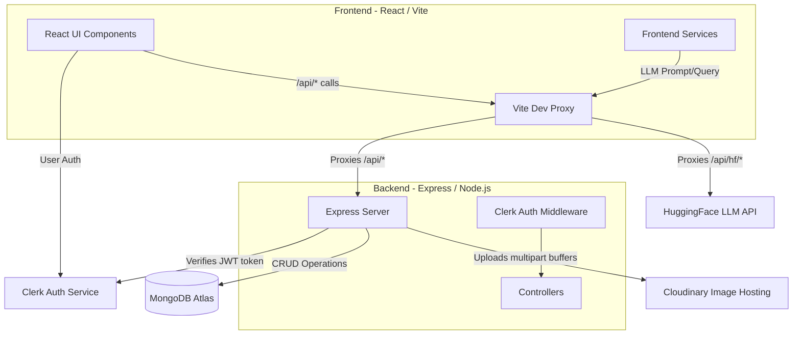

# KarigarAI Master Reference Document

This document serves as the comprehensive architectural and functional reference for the KarigarAI codebase. It contains end-to-end details, data flows, API specifications, and architectural diagrams.

---

## 1. Architecture Overview

### System Architecture Diagram

### Integration Explanations
* **Frontend to Backend connection:** The React application makes HTTP requests to `/api/*`. In development, `vite.config.js` proxies these requests to `http://localhost:5001`.
* **Clerk Auth:** Clerk manages user identity. The frontend uses Clerk's React SDK (`<ClerkProvider>`, `<SignIn />`, `useUser()`). When the frontend interacts with authenticated backend routes, it relies on passing the Bearer token manually (though the frontend codebase currently seems to omit sending tokens in some `fetch` calls). The backend verifies tokens using the Clerk `JWKS` endpoint via the `jose` library.
* **MongoDB:** Serves as the primary database, housing schemas for Profiles, Artisans, and Products. `mongoose` is used for modeling and querying.
* **Cloudinary:** Used for storing artisan avatars, workshop images, and product photos. Multer receives multipart/form-data on the backend and buffers the files in memory. Then, streams are uploaded to Cloudinary SDK which returns the secure URLs.
* **HuggingFace (AI/LLM):** Connects to `meta-llama/Llama-3.2-3B-Instruct` model for the Chat Assistant and Story Generator. **Why it's wired this way:** The LLM API is called directly from the frontend (proxied via `vite.config.js` to `router.huggingface.co`) to minimize backend load. However, this exposes the `VITE_HF_TOKEN` in the frontend bundle.

---

## 2. Environment & Config

### Frontend Environment Variables (`/.env`)
| Variable | Description | Used In |
| --- | --- | --- |
| `VITE_HF_TOKEN` | HuggingFace API key for AI generation. | `src/services/aiService.js:5` |
| `VITE_CLERK_PUBLISHABLE_KEY` | Clerk Publishable key to initialize the React SDK. | `src/main.jsx:6` |

### Backend Environment Variables (`/backend/.env`)
| Variable | Description | Used In |
| --- | --- | --- |
| `PORT` | The port the Express server listens on (5001). | `backend/server.js:17` |
| `NODE_ENV` | Environment identifier (development). | `backend/server.js:27` |
| `MONGODB_URI` | MongoDB Atlas Connection string. | `backend/config/db.js` |
| `CLOUDINARY_CLOUD_NAME` | Cloudinary account cloud name. | `backend/config/cloudinary.js`, Middleware |
| `CLOUDINARY_API_KEY` | Cloudinary API Key. | `backend/config/cloudinary.js` |
| `CLOUDINARY_API_SECRET` | Cloudinary API Secret. | `backend/config/cloudinary.js` |
| `CLERK_ISSUER` | Base URL for Clerk issuer to fetch JWKS. | `backend/middleware/clerkAuth.js:27` |
| `FRONTEND_ORIGIN` | Allowed origin for CORS (e.g. `http://localhost:5173`). | `backend/server.js:18` |

---

## 3. Backend — Route by Route

### Profile Routes (`backend/routes/profile.js`)
| Method | Path | Middleware Chain | Controller |
| --- | --- | --- | --- |
| `POST` | `/api/profile/bootstrap` | `validate(bootstrapProfileBodySchema)` | `bootstrapProfile` |
| `GET` | `/api/profile` | `validate(getProfileQuerySchema)` | `getProfileByEmail` |
| `PUT` | `/api/profile` | `upload.single('profileImage'), validate(updateProfileBodySchema)` | `updateProfileByEmail` |

* **`bootstrapProfile(req, res, next)`** (`backend/controllers/profileController.js`)
  Creates a basic user profile if it doesn't already exist. Idempotent and uses `findOneAndUpdate` with `upsert` and `$setOnInsert` to prevent race conditions during frontend mounts. Returns the profile document. 
* **`getProfileByEmail(req, res, next)`** (`backend/controllers/profileController.js`)
  Queries the `Profile` model by email (from `req.query`). Returns 404 if not found.
* **`updateProfileByEmail(req, res, next)`** (`backend/controllers/profileController.js`)
  Updates a profile based on email query. If `req.file` exists, uploads it to Cloudinary (`karigarai/profiles`). Uses `$set` in `findOneAndUpdate`. 

### Artisan Routes (`backend/routes/artisan.js` & `backend/routes/artisans.js`)
*Note: The routes are somewhat duplicated across `artisan.js` and `artisans.js`.*
| Method | Path | Middleware Chain | Controller |
| --- | --- | --- | --- |
| `POST` | `/api/artisan/register` | `upload.fields([...]), validate(registerArtisanBodySchema)` | `registerArtisan` |
| `GET` | `/api/artisan/:id` | `validate(artisanIdParamsSchema)` | `getArtisanById` |
| `GET` | `/api/artisan/:id/products` | `validate(artisanIdParamsSchema)` | `getProductsByArtisan` |
| `GET` | `/api/artisans/:id` | `validate(artisanIdParamsSchema)` | `getArtisanById` |
| `GET` | `/api/artisans/:id/products`| `validate(artisanIdParamsSchema)` | `getProductsByArtisan` |

* **`registerArtisan(req, res, next)`** (`backend/controllers/artisanController.js`)
  Registers a new artisan. Uploads `artisanPhoto`, `workshopPhoto`, and `sampleProducts` iterably to Cloudinary. Uses `findOneAndUpdate` with `upsert` to create the artisan linked to the user's email. Updates the associated `Profile` role to `'artisan'` and assigns `artisanId`.
* **`getArtisanById(req, res, next)`** (`backend/controllers/artisanController.js`)
  Finds an Artisan document by ObjectId.
* **`getProductsByArtisan(req, res, next)`** (`backend/controllers/artisanController.js`)
  Queries the `Product` collection where `artisanId` equals the requested ID. Returns array of products.

### Product Routes (`backend/routes/products.js`)
| Method | Path | Middleware Chain | Controller |
| --- | --- | --- | --- |
| `GET` | `/api/products/` | `validate(getProductsQuerySchema)` | `getAllProducts` |
| `GET` | `/api/products/:id` | `validate(productIdParamsSchema)` | `getProductById` |
| `POST` | `/api/products/` | `requireClerkAuth, upload.array('images', 6), validate(createProductBodySchema)` | `createProduct` |
| `POST` | `/api/products/test` | `upload.array('images', 6), validate(createProductBodySchema)` | `createProduct` |

* **`getAllProducts(req, res, next)`** (`backend/controllers/productController.js`)
  Fetches all products with pagination (`page`, `limit`), filtering by `category` and `artisanId`, and supports text search using Mongo's `$text` index. Returns an array of products.
* **`getProductById(req, res, next)`** (`backend/controllers/productController.js`)
  Retrieves product by ID and increments the `views` count using `$inc: { views: 1 }`.
* **`createProduct(req, res, next)`** (`backend/controllers/productController.js`)
  Creates a new product. Maps over uploaded `req.files`, uploads to Cloudinary asynchronously, appends to `images`, and calls `Product.create()`.
* ⚠️ **DEV/TEST LEFTOVER:** The `/api/products/test` route bypasses all authentication. It is explicitly invoked by the Frontend (`Dashboard.jsx`), making product creation unauthenticated in practice.

---

## 4. Backend — Models

### Profile (`backend/models/Profile.js`)
| Field | Type | Attributes |
| --- | --- | --- |
| `username` | String | required, maxlength: 120 |
| `email` | String | required, unique (indexed), lowercase |
| `phone` | String | default: '' |
| `address` | String | default: '' |
| `bio` | String | default: '', maxlength: 2000 |
| `profileImage` | String | default: '' |
| `role` | String | enum: ['user', 'buyer', 'artisan'], default: 'buyer', indexed |
| `artisanId` | ObjectId | ref: 'Artisan', default: null, indexed |
*(Schema includes `timestamps: true`)*

### Artisan (`backend/models/Artisan.js`)
| Field | Type | Attributes |
| --- | --- | --- |
| `userId` | ObjectId | ref: 'Profile', indexed |
| `email` | String | required, unique (indexed), lowercase |
| `name` | String | required |
| `phone`, `location` | String | default: '' |
| `craftType`, `experienceYears`, `story` | Mixed | artisan specific text/number fields |
| `shopName`, `shopDescription`, `productCategories`| Mixed | business details (`productCategories` is `[String]`) |
| `monthlyProduction` | String | default: '' |
| `artisanPhoto`, `workshopPhoto` | String | Cloudinary URLs |
| `sampleProducts` | [Object] | `{ imageUrl: String, caption: String }` |
| `paymentDetails` | Object | `{ upiId, accountNumber, ifscCode }` |
| `status` | String | enum: ['pending', 'approved', 'rejected'], default: 'pending', indexed |
*(Schema includes `timestamps: true`)*

### Product (`backend/models/Product.js`)
| Field | Type | Attributes |
| --- | --- | --- |
| `title`, `description` | String | required title |
| `price` | Number | required, min: 0 |
| `category` | String | indexed |
| `artisanId` | ObjectId | ref: 'Artisan', required, indexed |
| `artisanName`, `location` | String | indexed |
| `images` | [String] | Array of Cloudinary URLs |
| `stock`, `views` | Number | defaults: 0. `views` is indexed. |
*(Schema includes `timestamps: true`)*
**Indexes:** Optimization indexes on `{ category: 1, createdAt: -1 }` and a Text Index on `{ title, description, artisanName, location }`.

---

## 5. Backend — Middleware

* **`clerkAuth.js` (`requireClerkAuth`)**
  Main authentication middleware for server-side endpoints.
  **Flow:** 
  1. Extracts the Bearer token from `req.headers.authorization`.
  2. Uses `jose.createRemoteJWKSet` to fetch public keys from ``${process.env.CLERK_ISSUER}/.well-known/jwks.json``.
  3. Verifies the JWT signature with `jose.jwtVerify`.
  4. Attaches `req.auth = { userId: payload.sub, sessionId: payload.sid, orgId: payload.org_id, claims: payload }`.
* **`upload.js` (`upload`, `uploadBufferToCloudinary`)**
  Configures multer memory storage with an 8MB limit (max 6 files). Provides a utility wrapper around `cloudinary.uploader.upload_stream` that resolves via Promise to handle buffer uploads cleanly.
* **`validate.js` (`validate`)**
  Accepts a Zod schema and validates `req.body`, `req.query`, and `req.params`. Attaches the validated parsed output to `req.validated`.
* **`errorHandler.js` (`errorHandler`, `notFound`)**
  Global standard error handlers mapping status codes to consistent JSON error structures.

---

## 6. Frontend — Components

### Layout & Navigation components
* **`App.jsx`**: Central application state manager. Holds `currentPage`, `selectedProduct`, and `isChatOpen` states. Renders layout components and acts as a router using a switch statement. Defines custom event listener `navigate-to`.
* **`Navigation.jsx`**: Top app bar. Reads `currentPage` as prop. Uses Clerk's `<SignedIn />`, `<SignedOut />`, and `<UserButton />` components to conditionally render auth buttons.
* **`Footer.jsx`**: Standard UI footer shell.

### Auth Components
* **`LoginPage.jsx` / `SignUpPage.jsx`**: Simple UI wrappers returning Clerk's `<SignIn />` and `<SignUp />` components configured for virtual routing.

### Marketplace Components
* **`Marketplace.jsx`**: Main shop page. Uses `useState` for search & category filtering. Triggers `GET /api/products` on mount. Filters frontend array (`filteredProducts`). Calls `setSelectedProduct` when viewing to open `ProductModal`. 
* **`ProductModal.jsx`**: Detailed product dialog with image carousel (`activeIndex`), description, and static placeholders for Add to Cart.

### Artisan Dashboard & Workflows
* **`Dashboard.jsx`**: 
  - **State variables:** `activeSection`, `profile`, `products`, `addProductForm`, various loading and error states.
  - **Logic triggers:** 
    - Mount: Fetches `GET /api/profile?email=...` to load profile data. Implicitly calls `/api/profile/bootstrap` to auto-enroll new users.
    - If `profile.artisanId` exists, triggers `GET /api/artisans/:id/products` to fetch seller catalog.
  - **Interactions:** "Save Profile" hits `PUT /api/profile`. "Register Artisan" hits `POST /api/profile/register-artisan` (⚠️ **Bug/Gap:** There is no such route defined in the backend! Registration goes through `RegisterArtisanPage.jsx` normally). "Submit Product" hits `POST /api/products/test` (sending multipart form).
* **`RegisterArtisanPage.jsx`**: 
  Full comprehensive multi-step form to become an artisan. Sends FormData with nested images (files state) to `POST /api/artisan/register`. Upon success, navigates via state to dashboard.

### AI Features
* **`StoryGenerator.jsx`**: 
  User inputs form data about their crafts. Calls `aiService.generateStory()` on submit.
* **`ChatModal.jsx`**:
  Floating bottom right chat button. Retains chat `messages` list in state. Handles user input text or voice (Web Speech API). Calls `aiService.chatWithAI()`.

---

## 7. Frontend — Services

### `aiService.js`
Handles communication with the HuggingFace LLM APIs by making `axios` requests to `/api/hf/v1/chat/completions`.
* **`chatWithAI(userMessage, history, language)`**: First checks the static `knowledgeBase` for hardcoded keyword responses. If no match, prepends a configured system prompt (translating to Hindi if requested) and formats history into message chunks. Returns the LLM textual response. 
* **`generateStory(details, language)`**: Generates a long-form system prompt and user prompt interpolating the artisan details. Queries the LLM and returns the resulting story string.

### `knowledgeBase.js`
Static file exporting an array of objects (`keywords`, `answer`, `category`).
* **`findAnswer(query)`**: Lowercases query and uses `.find()` with `.some()` to detect array of keywords present in the string. Short-circuits LLM if exact keyword intent matches (e.g., 'kyc', 'loan').

---

## 8. Data Flow Traces

### a) User signs up and lands on the dashboard
1. User interacts with `<SignUp />` in `src/components/SignUpPage/SignUpPage.jsx`. Authentication succeeds via Clerk popup/redirect.
2. User is authenticated; UI navigates back. `App.jsx` handles state. User clicks "Dashboard".
3. `Dashboard.jsx` mounts. `const { user } = useUser()` pulls down Clerk identity object.
4. `useEffect` in `Dashboard.jsx` triggers:
   a. `POST /api/profile/bootstrap` with `username` and `email` to `backend/controllers/profileController.js`.
   b. `profileController` runs `findOneAndUpdate(${email})` with `$setOnInsert` and returns success.
   c. `Dashboard.jsx` calls `GET /api/profile?email=${email}`.
5. Profile sets in state. Dashboard renders in 'buyer' role view.

### b) User views the product marketplace
1. User clicks "Shop" in navigation. `Marketplace.jsx` mounts.
2. `useEffect` makes standard `fetch('/api/products')` (No Auth headers). 
3. Request routed through Vite proxy to `backend/routes/products.js` -> `getAllProducts` in `backend/controllers/productController.js`.
4. Controller queries `Product.find().lean()`, returns JSON array.
5. `Marketplace.jsx` maps JSON via `useMemo` into `uiProducts`.
6. User clicks product to open `ProductModal.jsx`. 
7. User views product data.

### c) An artisan registers and uploads a product
1. User on Dashboard hits "Register as Artisan". (Which actually fires event `navigate-to 'register-artisan'`).
2. `App.jsx` routes to `RegisterArtisanPage.jsx`.
3. User fills out multipart form and adds photos. Clicks Submit.
4. Client constructs `FormData` and posts to `POST /api/artisan/register` -> `backend/routes/artisan.js`.
5. `upload.fields([...])` middleware intercepts and buffers images. 
6. `registerArtisan` controller loops files, calls `uploadBufferToCloudinary()`. 
7. Creates `Artisan` mongodb record. Updates `Profile` role to `'artisan'` and links `userId`.
8. User lands back on `Dashboard.jsx`. `profile.role` is 'artisan', rendering "Add Product" tab.
9. User fills out product form, adds image -> `handleSubmitProduct`.
10. System posts FormData to `POST /api/products/test`.
11. `createProduct` in `backend/controllers/productController.js` creates Cloudinary records, creates `Product` in mongo.
12. Dashboard local state prepends the new product to the list.

### d) User generates an AI story
1. User visits `/story` mapped to `StoryGenerator.jsx`.
2. Fills out text fields (Craft type, location, materials).
3. Hits "Submit" -> calls `aiService.generateStory(formData, language)` (`src/services/aiService.js`).
4. `aiService` constructs a prompt string and POSTs JSON to `/api/hf/v1/chat/completions` with local header `Authorization: Bearer <VITE_HF_TOKEN>`.
5. Vite intercepts `/api/hf/` and proxies to `https://router.huggingface.co/v1/chat/completions`.
6. Text returns. `aiService` extracts `response.data.choices[0].message.content`.
7. `StoryGenerator.jsx` renders state in a UI Card.

---

## 9. Known Gaps / Rough Edges

* **Clerk Auth Bypass on Product Creation:** The frontend (`Dashboard.jsx`) submits product creations to `POST /api/products/test` instead of the secured `POST /api/products/`. The secured route expects `requireClerkAuth`, but since the `fetch` in `Dashboard.jsx` does NOT include the Auth Token Header anyway, it relies on the unauthenticated testing route to function. 
* **Missing API Route:** Early in `Dashboard.jsx`, there is a function `handleRegisterArtisan` that calls `POST /api/profile/register-artisan` to quick-register an artisan. However, that specific nested route does not exist in the backend (instead, standard registration relies on `/api/artisan/register`). 
* **Missing App-level Auth Token Propagation:** The frontend heavily leverages `Clerk` components for login, but when making API requests (`fetch` calls in `Dashboard.jsx`, `Marketplace.jsx`), it relies on query params like `?email=...` or bypasses auth entirely instead of calling `await getToken()` to add Bearer tokens to the API headers.
* **LLM Key Exposure:** Because AI calls are initiated directly from the frontend (`aiService.js`) to the Huggingface server proxy, the variable `import.meta.env.VITE_HF_TOKEN` must be statically injected into the client bundle, exposing the secret key to anyone inspecting the frontend code.
* **Missing Error Boundaries:** Basic React rendering errors inside modals or mapping components will crash the UI tree.
* **Pagination & Search Implementation Limits:** The frontend `Marketplace.jsx` does search and filtering locally in JavaScript using `.filter()` on `uiProducts` instead of passing `?search=` to the backend, rendering the backend paging and Mongo Text Search logic entirely unused.
* **Partial i18n:** `Language` choices are present on `StoryGenerator` and `ChatModal` (switching LLM personas to Hindi), but the actual User Interface doesn't translate.
* **Dangling Hardcoded Data:** The "Total Sales" logic in `Dashboard.jsx` is mathematically incorrect (it multiplies `views` by `price` to masquerade as `revenue`). The variables `salesData` and `growthData` arrays are unused.
* **"Add to Cart" Functionality:** This button appears on the `ProductModal.jsx` and `Marketplace.jsx` but has no logic attached (it's completely non-functional).
